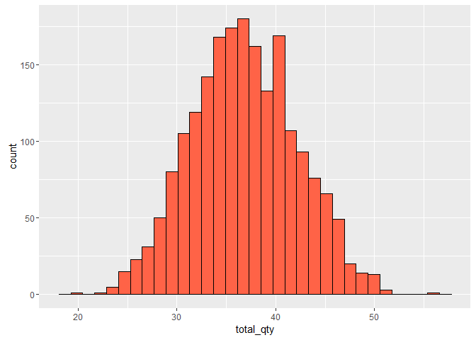

# Module 1 - Quizz
Nicolas  
April 25, 2016  

### Loading the data

```r
setwd('C:/Users/Nicolas/Desktop/Projets Tech/MOOCS/Business Analytics/Module 1/')
data <- read.csv(file = 'PASTAPURCHASE.csv')
```

### 1. What is the mean and standard deviation of the quantity of pasta purchased by time unit by household?


```r
mean(data$PASTA)
```

```
## [1] 1.841545
```

```r
sd(data$PASTA)
```

```
## [1] 1.025911
```

The mean is 1.84 (qty/time unit/household) and the standard deviation is 1.02 (qty/time unit/household).

### 2. In which area are located (i) the poorest household and (ii) the wealthiest household?


```r
library(dplyr)
```

```
## 
## Attaching package: 'dplyr'
```

```
## The following objects are masked from 'package:stats':
## 
##     filter, lag
```

```
## The following objects are masked from 'package:base':
## 
##     intersect, setdiff, setequal, union
```

```r
by_income <- data %>% group_by(INCOME) %>% 
                summarize( 
                            area = mean(AREA)
                            ) 
by_income[ which.min(by_income$INCOME), ]
```

```
## Source: local data frame [1 x 2]
## 
##     INCOME  area
##      (dbl) (dbl)
## 1 609.1072     2
```

```r
by_income[ which.max(by_income$INCOME), ]
```

```
## Source: local data frame [1 x 2]
## 
##   INCOME  area
##    (dbl) (dbl)
## 1 141067     5
```

The poorest household is in area #2 and the wealthiest household is in area #5.

### 3. What is the maximum pasta quantity a household has bought over the whole time period? (Sum the quantity of pasta by household over time and indicate the maximum)


```r
pasta_qty <- data %>% group_by(HHID) %>% summarize( pasta_qty = sum(PASTA) )

max(pasta_qty$pasta_qty)
```

```
## [1] 55.36193
```

The maximum pasta quantity a household has bought over the whole time period is 55.36.

### 4. What is the average income of households living in area 4?


```r
household_area4 <- data %>% filter(AREA == 4) %>%
                   group_by(HHID) %>% summarize( income = mean(INCOME) )

mean(household_area4$income)
```

```
## [1] 29260.13
```

```r
# OR

mean(data[data$AREA == 4,]$INCOME)
```

```
## [1] 29260.13
```

The average income of households living in area 4 is $29,260.

### 5. How many households live in area 2, earn more than 20k, and have purchased more than 30 units of pasta over the whole time period?


```r
household_area2 <- data %>% filter(AREA == 2) %>% filter(INCOME > 20000) %>%
                   group_by(HHID) %>% 
                   summarize( total_qty = sum(PASTA) ) %>% filter(total_qty > 30)

nrow( household_area2 )
```

```
## [1] 218
```

218 households live in area 2, earn more than 20k, and have purchased more than 30 units of pasta over the whole time period.

### 6. What is the correlation between the purchases of pasta and the exposures?


```r
library(ggplot2)

ggplot(data=data, aes(x=EXPOS,y=PASTA)) + 
  geom_jitter(shape = 21, colour = "black", fill = "orange")  # for shapes that have a border (like 21)
```


```r
cor.test(data$EXPOS,data$PASTA) 
```

```
## 
## 	Pearson's product-moment correlation
## 
## data:  data$EXPOS and data$PASTA
## t = 69.112, df = 39998, p-value < 2.2e-16
## alternative hypothesis: true correlation is not equal to 0
## 95 percent confidence interval:
##  0.3178348 0.3353439
## sample estimates:
##       cor 
## 0.3266174
```

The correlation between the purchases of pasta and the exposures is 0.32 (positive correlation, although quite low).

### 7. Which of the following graphs reports the correct histogram by household of the total purchase of pasta made by the household over the whole period? (Sum the purchases by household and make a histogram.)


```r
by_household <- data %>% group_by(HHID) %>% summarize( total_qty = sum(PASTA) )

ggplot(data=by_household, aes(x=total_qty)) + geom_histogram(color = 'black', fill = "tomato")
```

```
## `stat_bin()` using `bins = 30`. Pick better value with `binwidth`.
```




### 8. Which of the following graphs reports the correct time series of the overall total purchase of pasta? (Sum the purchases by time units and plot the quantity by time unit.)


```r
by_time <- data %>% group_by(TIME) %>% summarize( total_qty = sum(PASTA) )

ggplot(data=by_time, aes(x=TIME,y=total_qty)) + 
  geom_line(colour = "darkred", size = 1) +
  geom_smooth()
```


