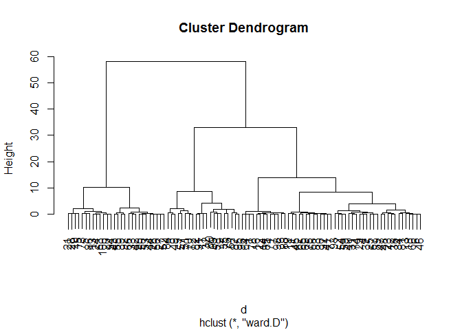
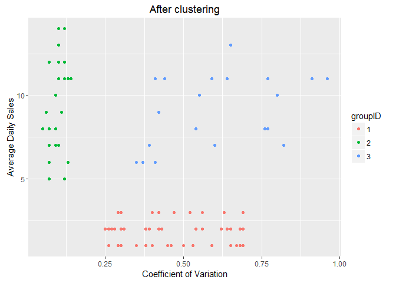
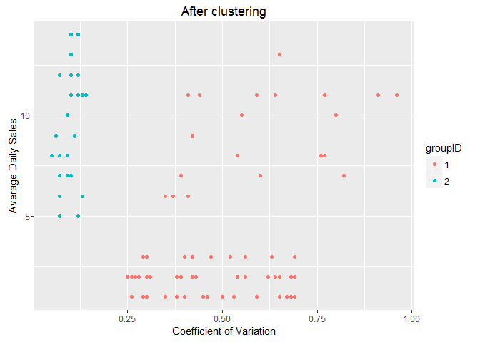
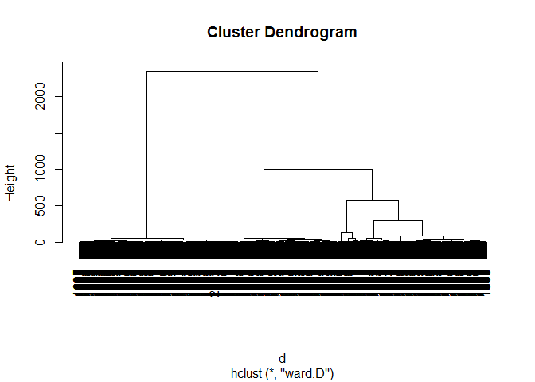
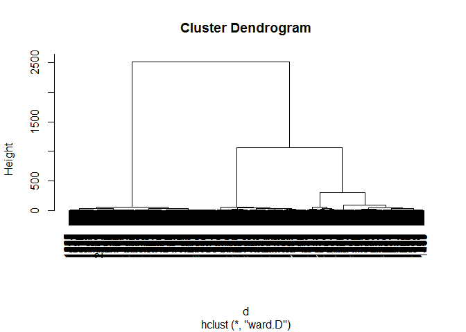
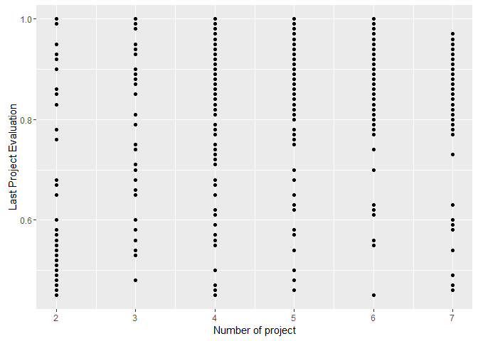
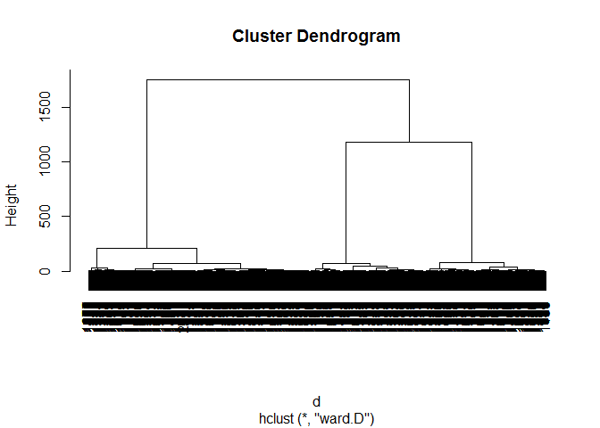
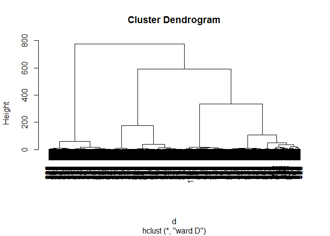
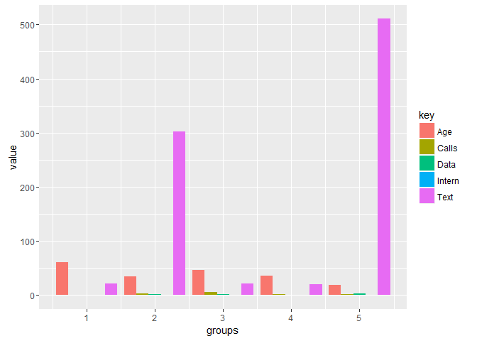

# Module 2 - Finding groups within data
Nicolas  
April 26, 2016  

## Example #1 - Supply chain and logistics management of Stock Keeping Units (SKU)

The objective here is to explore the dataset to identify different groups of products that shares similarities and that can be treated in a similar way. 

### Loading the dataset

```r
rm(list=ls(all=TRUE))    # clean up the memory of your current R session
data <- read.csv(file = 'DATA_2.01_SKU.csv')
```

### Exploring the dataset

```r
str(data)
```

```
## 'data.frame':	100 obs. of  2 variables:
##  $ ADS: int  1 3 1 2 9 2 2 8 11 6 ...
##  $ CV : num  0.68 0.4 0.59 0.39 0.11 0.56 0.69 0.76 0.96 0.13 ...
```

```r
summary(data) 
```

```
##       ADS              CV       
##  Min.   : 1.00   Min.   :0.050  
##  1st Qu.: 2.00   1st Qu.:0.130  
##  Median : 3.00   Median :0.400  
##  Mean   : 5.61   Mean   :0.396  
##  3rd Qu.:10.00   3rd Qu.:0.590  
##  Max.   :14.00   Max.   :0.960
```

Let's plot our data to see if we can identify groups visually: 

```r
library(ggplot2)

ggplot(data=data, aes(x=CV,y=ADS)) + 
  geom_point() +
  xlab("Coefficient of Variation") +
  ylab("Average Daily Sales") +
  ggtitle("SKU Example") +
  geom_vline(xintercept = 0.2, color='red') +
  geom_hline(yintercept = 4, color='red') +
  annotate("text", x = 0.15, y = 9.7, label = "Horses", color='red') +   #label the group "Horses"
  annotate("text", x = 0.65, y = 9, label = "Wild Bulls", color='red') +
  annotate("text", x = 0.8, y = 2, label = "Crickets", color='red')
```


### Hierarchical Clustering

Let's find groups using hierarchical clustering and check if we obtain similar results

```r
testdata <- data             # keeps our initial dataset safe 
testdata <- scale(testdata)  # normalizes the dataset (and transforms it to a matrix)
```

First, let's compute the distances of all the observations in our dataset

```r
d <- dist(testdata, method = "euclidean")    # distance matrix
```

and perform hiearchical clustering (Ward's method) and plot the dendogram

```r
fit <- hclust(d, method="ward.D")
plot(fit)    # plot dendrogram
```



Per the previous plot and the dendrogram, 3 clusters seems like a good choice:

```r
data$groupID <- cutree(fit,k=3)       # assign each point to one of our k=3 clusters 
#rect.hclust(fit, k=3, border="red")   # draw dendogram with red borders around the clusters
```

then finally plot the clusters

```r
data$groupID <- as.factor(data$groupID)      # set variable as factors

ggplot(data=data, aes(x=CV,y=ADS, color=groupID)) + 
  geom_point() +
  xlab("Coefficient of Variation") +
  ylab("Average Daily Sales") +
  ggtitle("After clustering")
```



### Questions

1/ What is the correct mean and median of the coefficient of variations of the sales in the SKU dataset?

```r
mean(data$CV)
```

```
## [1] 0.396
```

```r
median(data$CV)
```

```
## [1] 0.4
```
The mean is 0.396 and the median is 0.4.

2/ Do a hierarchical clustering on scaled data using an Euclidian distance and Ward.D clustering on the SKU dataset (DATA_2.01_SKU.csv). What are the resulting segments compared to what is shown in class if you decide to take only 2 clusters?

```r
data$groupID <- cutree(fit,k=2) 

# and plot:
data$groupID <- as.factor(data$groupID)      # set variable as factors

ggplot(data=data, aes(x=CV,y=ADS, color=groupID)) + 
  geom_point() +
  xlab("Coefficient of Variation") +
  ylab("Average Daily Sales") +
  ggtitle("After clustering")
```


With k=2 clusters, the segments "Crickets" and "Wild Bulls" are merged.


***
***


## Example #2 - HR analytics: multi-dimensional analysis

### Loading the dataset

```r
rm(list=ls(all=TRUE))
data <- read.csv(file = 'DATA_2.02_HR.csv')
```

### Exploring the dataset

```r
str(data)
```

```
## 'data.frame':	2000 obs. of  6 variables:
##  $ S      : num  0.38 0.8 0.11 0.72 0.37 0.41 0.1 0.92 0.89 0.42 ...
##  $ LPE    : num  0.53 0.86 0.88 0.87 0.52 0.5 0.77 0.85 1 0.53 ...
##  $ NP     : int  2 5 7 5 2 2 6 5 5 2 ...
##  $ ANH    : int  157 262 272 223 159 153 247 259 224 142 ...
##  $ TIC    : int  3 6 4 5 3 3 4 5 5 3 ...
##  $ Newborn: int  0 0 0 0 0 0 0 0 0 0 ...
```

```r
summary(data)
```

```
##        S             LPE              NP             ANH       
##  Min.   :0.09   Min.   :0.450   Min.   :2.000   Min.   :126.0  
##  1st Qu.:0.11   1st Qu.:0.520   1st Qu.:2.000   1st Qu.:146.0  
##  Median :0.41   Median :0.790   Median :4.000   Median :225.0  
##  Mean   :0.44   Mean   :0.721   Mean   :3.877   Mean   :207.9  
##  3rd Qu.:0.73   3rd Qu.:0.900   3rd Qu.:6.000   3rd Qu.:262.0  
##  Max.   :0.92   Max.   :1.000   Max.   :7.000   Max.   :310.0  
##       TIC           Newborn      
##  Min.   :2.000   Min.   :0.0000  
##  1st Qu.:3.000   1st Qu.:0.0000  
##  Median :4.000   Median :0.0000  
##  Mean   :3.878   Mean   :0.0525  
##  3rd Qu.:5.000   3rd Qu.:0.0000  
##  Max.   :6.000   Max.   :1.0000
```

### Hierarchical clustering

Normalizing the dataset:

```r
testdata <- data            # keeps our initial dataset safe
testdata <- scale(testdata) # normalizes the dataset (and transforms it to a matrix)
```

Then compute the distances of all the observations in our dataset:

```r
d <- dist(testdata, method = "euclidean")  # computes the distances of all the observations
```

And perform hiearchical clustering (Ward's method) and plot the dendogram:

```r
fit <- hclust(d, method="ward.D")
plot(fit)    # plot dendrogram
```



Per the dendrogram, 4 clusters seems like a good choice:

```r
data$groups <- cutree(fit,k=4)  # assign our points to our k=4 clusters 
#rect.hclust(fit, k=4, border="red")   # draw dendogram with red borders around the clusters
```

Then computes the average value of each variable for each cluster:

```r
library(dplyr)
```

```
## 
## Attaching package: 'dplyr'
```

```
## The following objects are masked from 'package:stats':
## 
##     filter, lag
```

```
## The following objects are masked from 'package:base':
## 
##     intersect, setdiff, setequal, union
```

```r
aggdata <- data %>% group_by(groups) %>% summarise_each(funs(mean))

aggdata
```

```
## Source: local data frame [4 x 7]
## 
##   groups         S       LPE       NP      ANH      TIC Newborn
##    (int)     (dbl)     (dbl)    (dbl)    (dbl)    (dbl)   (dbl)
## 1      1 0.4082346 0.5106936 2.000000 143.5044 3.000000       0
## 2      2 0.7355272 0.8732588 4.476038 237.7732 4.811502       0
## 3      3 0.1028571 0.8715126 6.237395 276.7353 4.115546       0
## 4      4 0.4455238 0.7195238 3.780952 204.3524 3.866667       1
```

```r
# or equivalently, using the aggregate function:
#aggdata <- aggregate(.~ groups, data=data, FUN=mean)
```

Computes the proportion of our data that is in each cluster:

```r
data %>% group_by(groups) %>% 
        summarise( count = n())  %>%
        mutate(freq = count / sum(count))
```

```
## Source: local data frame [4 x 3]
## 
##   groups count   freq
##    (int) (int)  (dbl)
## 1      1   793 0.3965
## 2      2   626 0.3130
## 3      3   476 0.2380
## 4      4   105 0.0525
```

```r
# or equivalently, using the aggregate function:

#proptemp <- aggregate(S ~ groups, data=data, FUN=length) # we create a variable called proptemp which computes the number of observations in each group (using the S variable, but you can take any.)
#aggdata$proportion <- (proptemp$S)/sum(proptemp$S) # proportion of observations in each group we compute the ratio between proptemp and the total number of observations
#aggdata <- aggdata[order(aggdata$proportion,decreasing=T),] # Let's order the groups from the larger to the smaller
```

### Removing one variable to try to improve accuracy

As discussed in the videos, let's remove the Newborn variable, and try clustering again
This variable is not really relevant and by being a dummy drives the clustering too much

```r
testdata <- data[,1:5] # we create a new dataset, called "testdata", that includes the 5 first columns of our original dataset 
```

We then rerun the code used above:

```r
testdata <- scale(testdata) # normalizes our original variables
d <- dist(testdata, method = "euclidean") # computes distances between observations
fit <- hclust(d, method="ward.D") # Hierachical Clustering using Ward criterion
plot(fit)
```



Per the dendrogram, 4 clusters seems like a good choice:

```r
data$groups <- cutree(fit,k=4)  # assign our points to our k=4 clusters 
#rect.hclust(fit, k=4, border="red")   # draw dendogram with red borders around the clusters
```

Note that we re-use the original dataset "data" (where the variable Newborn is still present) and not "testdata" (where the variable Newborn has been removed)
Hence we'll be able to produce summary statistics also for the Newborn variable regardless it wasn't included when doing the second version of the clustering

Then recomputes the average value of each variable for each cluster:

```r
aggdata <- data %>% group_by(groups) %>% summarise_each(funs(mean))
aggdata
```

```
## Source: local data frame [4 x 7]
## 
##   groups         S       LPE       NP      ANH      TIC    Newborn
##    (int)     (dbl)     (dbl)    (dbl)    (dbl)    (dbl)      (dbl)
## 1      1 0.4083871 0.5105615 2.000000 143.5735 3.000000 0.05256870
## 2      2 0.8184082 0.9225306 4.604082 247.3918 5.206122 0.05102041
## 3      3 0.1033399 0.8718182 6.201581 276.3004 4.100791 0.04743083
## 4      4 0.5076647 0.7276048 4.107784 207.3473 3.706587 0.07185629
```

And recomputes the proportion of our data that is in each cluster:

```r
data %>% group_by(groups) %>% 
        summarise( count = n())  %>%
        mutate(freq = count / sum(count))
```

```
## Source: local data frame [4 x 3]
## 
##   groups count   freq
##    (int) (int)  (dbl)
## 1      1   837 0.4185
## 2      2   490 0.2450
## 3      3   506 0.2530
## 4      4   167 0.0835
```

To export our results, we can run the following code

```r
# write.csv(aggdata, "HR_example_Numerical_Output.csv", row.names=FALSE)
# This allows to import the data in Excel for instance where we can prepare it for the presentation, if needed
```

### Questions

1. Plot of the last project evaluation as a function of the number of projects done:

```r
ggplot(data=data, aes(x=NP,y=LPE)) + 
  geom_point() +
  xlab("Number of project") +
  ylab("Last Project Evaluation")
```



2. If you cluster the HR dataset on Satisfaction, Project Evaluation and Number of Projects Done and that you keep 2 segments using the same values for the other specifications (scaling, distance type and clustering algorithm), what's the resulting median Satisfaction per segment?

```r
testdata <- data[,1:3]   # keeping only Satisfaction, Project Evaluation and Number of Projects

testdata <- scale(testdata) # normalizes our original variables
d <- dist(testdata, method = "euclidean") # computes distances between observations
fit <- hclust(d, method="ward.D") # Hierachical Clustering using Ward criterion
plot(fit)
```



```r
data$groups <- cutree(fit,k=2)      # k=2 clusters

aggdata <- data %>% group_by(groups) %>% summarise_each(funs(median))
aggdata
```

```
## Source: local data frame [2 x 7]
## 
##   groups     S   LPE    NP   ANH   TIC Newborn
##    (int) (dbl) (dbl) (int) (int) (int)   (int)
## 1      1  0.41  0.52     2   146     3       0
## 2      2  0.64  0.90     5   260     5       0
```
The median of Satisfation per segment is 0.41 for segment #1 and 0.64 for segment #2.


***
***


## Example #3 - Telecommunication company: example of customer segmentation

The objective here is to find segments of customers that use the services in a similar ways.

### Loading the dataset

```r
rm(list=ls(all=TRUE))
data <- read.csv(file = 'DATA_2.03_Telco.csv')
```

### Exploring the dataset

```r
str(data)
```

```
## 'data.frame':	1000 obs. of  5 variables:
##  $ Calls : num  1.12 1.08 3.54 1.09 1.04 5.59 1.19 3.07 5.34 2.43 ...
##  $ Intern: num  0.19 0.22 0.26 0.21 0.24 0.88 0.19 0.34 0.99 0.09 ...
##  $ Text  : num  23.9 17.8 289.8 19.1 20.3 ...
##  $ Data  : num  0.18 0.23 1.99 0.21 0.2 2.02 0.24 2.06 0.97 0.46 ...
##  $ Age   : int  60 54 34 61 56 41 71 30 41 33 ...
```

```r
summary(data)
```

```
##      Calls           Intern            Text             Data      
##  Min.   :0.850   Min.   :0.0900   Min.   : 17.01   Min.   :0.170  
##  1st Qu.:1.490   1st Qu.:0.1100   1st Qu.: 20.77   1st Qu.:0.520  
##  Median :2.040   Median :0.2200   Median :190.53   Median :1.980  
##  Mean   :2.630   Mean   :0.4048   Mean   :225.02   Mean   :1.965  
##  3rd Qu.:3.493   3rd Qu.:0.7900   3rd Qu.:449.44   3rd Qu.:2.902  
##  Max.   :6.000   Max.   :1.2000   Max.   :598.94   Max.   :4.790  
##       Age       
##  Min.   :12.00  
##  1st Qu.:24.00  
##  Median :35.00  
##  Mean   :37.78  
##  3rd Qu.:51.00  
##  Max.   :72.00
```

### Hierarchical clustering

Let's normalize our variables and compute the distance between variables:

```r
testdata <- data             # keeps our intial dataset safe
testdata <- scale(testdata) # normalizes all variables

d <- dist(testdata, method = "euclidean")
```

and perform hiearchical clustering (Ward's method) and plot the dendogram:

```r
fit <- hclust(d, method="ward.D")
plot(fit)
```



Per the dendrogram, let's start with 8 clusters:

```r
data$groups <- cutree(fit, k=8)     # assign our points to our k=8 clusters 
#rect.hclust(fit, k=8, border="red")   # draw dendogram with red borders around the clusters
```

Then computes the average value of each variable for each cluster:

```r
aggdata <- data %>% group_by(groups) %>% summarise_each(funs(mean))
aggdata
```

```
## Source: local data frame [8 x 6]
## 
##   groups    Calls    Intern      Text      Data      Age
##    (int)    (dbl)     (dbl)     (dbl)     (dbl)    (dbl)
## 1      1 1.021134 0.2044845  20.87433 0.2088144 60.77835
## 2      2 3.090476 0.3082313 312.06755 2.0329932 30.74150
## 3      3 5.129716 1.0232955  21.32989 2.0599432 45.90909
## 4      4 3.540654 0.6533645 322.21607 2.1341121 40.08411
## 5      5 2.307582 0.1025275  20.57440 0.5201099 35.78022
## 6      6 1.550319 0.1013830 506.58840 3.0772340 14.31915
## 7      7 1.802025 0.1032278 513.06924 4.1231646 21.58861
## 8      8 1.679091 1.0509091 191.22182 1.4072727 32.84848
```

And computes the proportion of our data that is in each cluster:

```r
data %>% group_by(groups) %>% 
        summarise( count = n())  %>%
        mutate(freq = count / sum(count))
```

```
## Source: local data frame [8 x 3]
## 
##   groups count  freq
##    (int) (int) (dbl)
## 1      1   194 0.194
## 2      2   147 0.147
## 3      3   176 0.176
## 4      4   107 0.107
## 5      5    91 0.091
## 6      6    94 0.094
## 7      7   158 0.158
## 8      8    33 0.033
```

Let's try again with 5 segments

```r
data$groups <- cutree(fit, k=5)     # assign our points to our k=5 clusters 
#rect.hclust(fit, k=5, border="red")   # draw dendogram with red borders around the clusters
```

Then computes the average value of each variable for each cluster:

```r
aggdata <- data %>% group_by(groups) %>% summarise_each(funs(mean))
aggdata
```

```
## Source: local data frame [5 x 6]
## 
##   groups    Calls    Intern      Text      Data      Age
##    (int)    (dbl)     (dbl)     (dbl)     (dbl)    (dbl)
## 1      1 1.021134 0.2044845  20.87433 0.2088144 60.77835
## 2      2 3.096028 0.5222997 301.95599 1.9987456 34.46690
## 3      3 5.129716 1.0232955  21.32989 2.0599432 45.90909
## 4      4 2.307582 0.1025275  20.57440 0.5201099 35.78022
## 5      5 1.708135 0.1025397 510.65179 3.7330159 18.87698
```

And computes the proportion of our data that is in each cluster:

```r
data %>% group_by(groups) %>% 
        summarise( count = n())  %>%
        mutate(freq = count / sum(count))
```

```
## Source: local data frame [5 x 3]
## 
##   groups count  freq
##    (int) (int) (dbl)
## 1      1   194 0.194
## 2      2   287 0.287
## 3      3   176 0.176
## 4      4    91 0.091
## 5      5   252 0.252
```

To export our results, we can execute the following code

```r
# write.csv(aggdata, file = "aggdataTelco5seg.csv", row.names=FALSE)
```

### Bar chart

```r
library(tidyr)
aggdata.long <- aggdata %>% gather(key , value, -groups)   # reshaping data from wide to long
aggdata.long
```

```
## Source: local data frame [25 x 3]
## 
##    groups    key     value
##     (int)  (chr)     (dbl)
## 1       1  Calls 1.0211340
## 2       2  Calls 3.0960279
## 3       3  Calls 5.1297159
## 4       4  Calls 2.3075824
## 5       5  Calls 1.7081349
## 6       1 Intern 0.2044845
## 7       2 Intern 0.5222997
## 8       3 Intern 1.0232955
## 9       4 Intern 0.1025275
## 10      5 Intern 0.1025397
## ..    ...    ...       ...
```

```r
library(ggplot2)
ggplot(data=aggdata.long, aes(x=groups,y=value,fill=key)) + 
  geom_bar(stat="identity",position="dodge")
```



```r
# Draw the radar chart with the function stars()
#palette(rainbow(12, s = 0.6, v = 0.75)) # Select the colors to use
#stars(aggdata[,2:(ncol(data))], len = 0.6, key.loc = c(11, 6),xlim=c(2,12),main = "Segments", draw.segments = TRUE,nrow = 2, cex = .75,labels=aggdata$groups)
```
