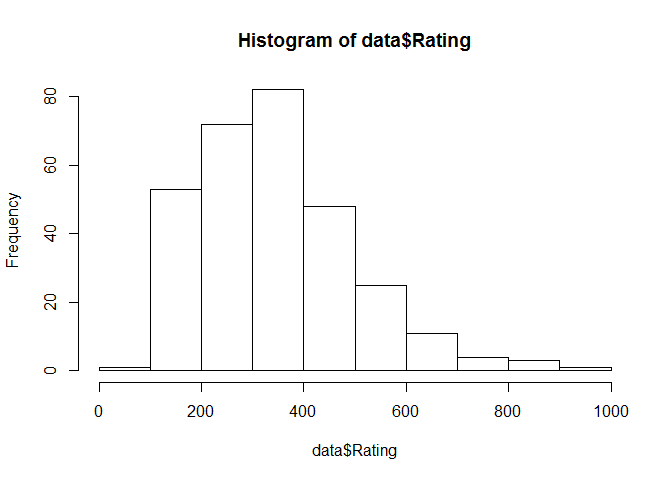
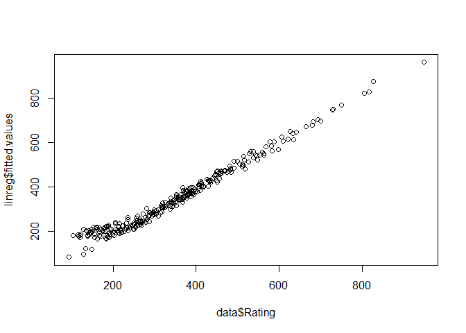
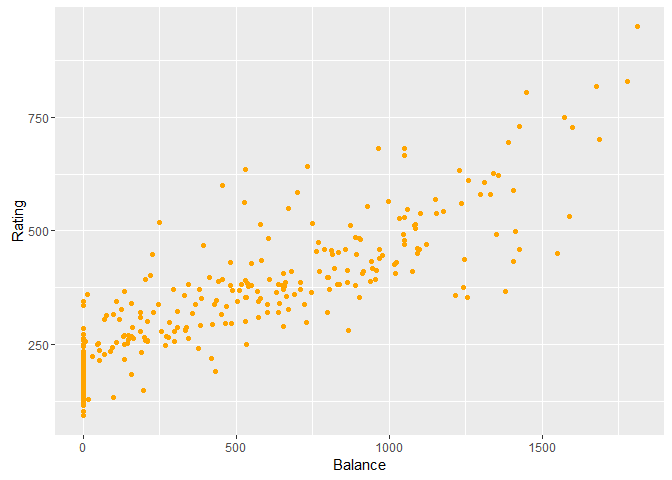
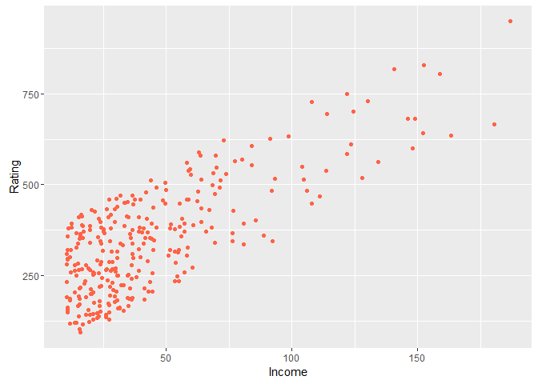
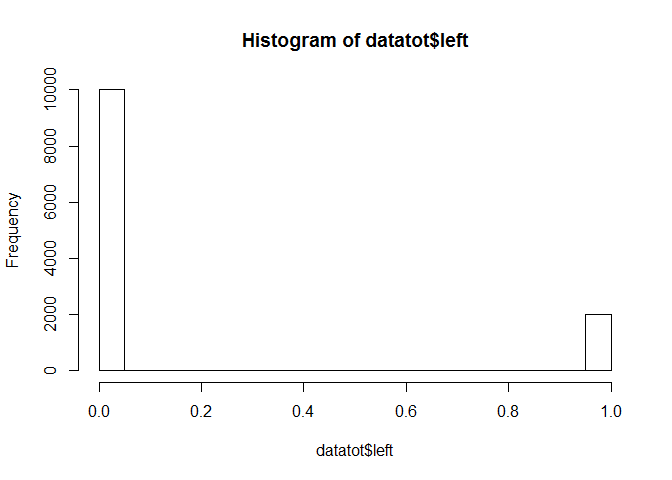
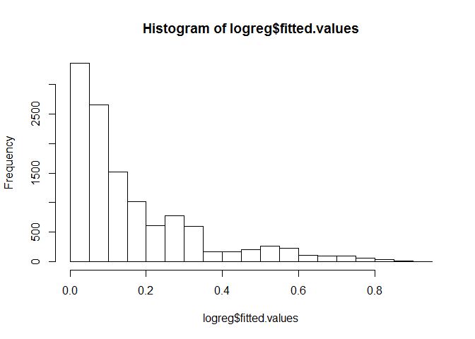
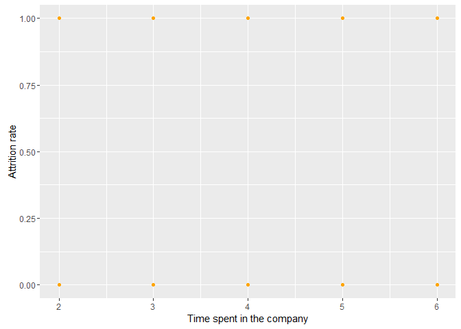
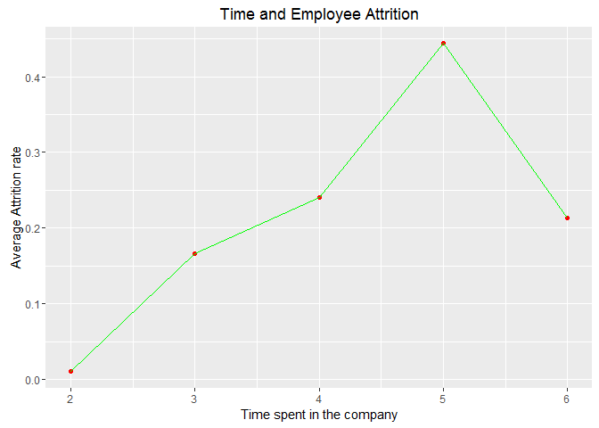
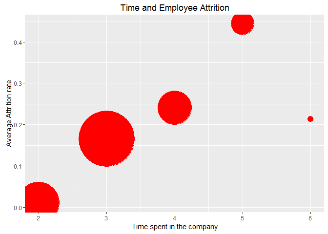
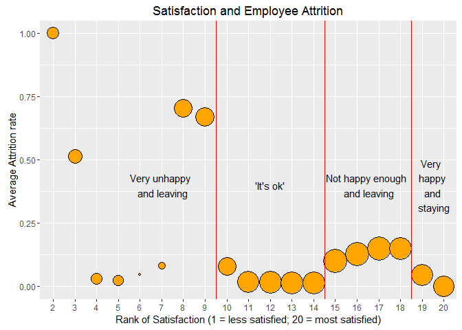

# Module 3 - Understanding causes and consequences
Nicolas  
April 27, 2016  

## Example #1 - Credit Scoring

### Loading the dataset

```r
rm(list=ls(all=TRUE))
setwd('C:/Users/Nicolas/Desktop/Projets Tech/MOOCS/Business Analytics/Module 3/')
data <- read.csv('DATA_3.01_CREDIT.csv')
```

### Exploring the dataset

```r
str(data)
```

```
## 'data.frame':	300 obs. of  10 variables:
##  $ Income   : num  14.9 106 104.6 148.9 55.9 ...
##  $ Rating   : int  283 483 514 681 357 569 259 512 266 491 ...
##  $ Cards    : int  2 3 4 3 2 4 2 2 5 3 ...
##  $ Age      : int  34 82 71 36 68 77 37 87 66 41 ...
##  $ Education: int  11 15 11 11 16 10 12 9 13 19 ...
##  $ Gender   : Factor w/ 2 levels " Male","Female": 1 2 1 2 1 1 2 1 2 2 ...
##  $ Student  : Factor w/ 2 levels "No","Yes": 1 2 1 1 1 1 1 1 1 2 ...
##  $ Married  : Factor w/ 2 levels "No","Yes": 2 2 1 1 2 1 1 1 1 2 ...
##  $ Ethnicity: Factor w/ 3 levels "African American",..: 3 2 2 2 3 3 1 2 3 1 ...
##  $ Balance  : int  333 903 580 964 331 1151 203 872 279 1350 ...
```

```r
summary(data)
```

```
##      Income           Rating          Cards            Age       
##  Min.   : 10.35   Min.   : 93.0   Min.   :1.000   Min.   :24.00  
##  1st Qu.: 21.03   1st Qu.:235.0   1st Qu.:2.000   1st Qu.:41.00  
##  Median : 33.12   Median :339.0   Median :3.000   Median :55.00  
##  Mean   : 44.05   Mean   :348.1   Mean   :3.027   Mean   :54.98  
##  3rd Qu.: 55.98   3rd Qu.:433.0   3rd Qu.:4.000   3rd Qu.:69.00  
##  Max.   :186.63   Max.   :949.0   Max.   :8.000   Max.   :91.00  
##    Education        Gender    Student   Married              Ethnicity  
##  Min.   : 5.00    Male :132   No :268   No :117   African American: 78  
##  1st Qu.:11.00   Female:168   Yes: 32   Yes:183   Asian           : 81  
##  Median :14.00                                    Caucasian       :141  
##  Mean   :13.39                                                          
##  3rd Qu.:16.00                                                          
##  Max.   :20.00                                                          
##     Balance       
##  Min.   :   0.00  
##  1st Qu.:  15.75  
##  Median : 433.50  
##  Mean   : 502.69  
##  3rd Qu.: 857.75  
##  Max.   :1809.00
```

In this dataset, the dependent variable is the rating variable, ie the variable we want to predict based on the other variables.

Histogram of the credit scores:

```r
hist(data$Rating)
```



```r
# or
# library(ggplot2)
# qplot(data$Rating, geom="histogram", binwidth=100)
```
The distribution is positively skewed. Most of the ratings are between 100 and 400.

We want to understand the main drivers of the credit score. First, we can explore the Pearson correlation coefficient between all the numerical variables of the sample (except for categorical variables such as gender or ethnicity):

```r
cor(data[,c(1:5,10)])
```

```
##                Income      Rating      Cards         Age   Education
## Income     1.00000000  0.77116741 0.02887452  0.12320067 -0.07095917
## Rating     0.77116741  1.00000000 0.09585441  0.04237663 -0.09543257
## Cards      0.02887452  0.09585441 1.00000000  0.05465525  0.01517640
## Age        0.12320067  0.04237663 0.05465525  1.00000000 -0.04617816
## Education -0.07095917 -0.09543257 0.01517640 -0.04617816  1.00000000
## Balance    0.43232667  0.85982866 0.12384602 -0.05242587 -0.07316655
##               Balance
## Income     0.43232667
## Rating     0.85982866
## Cards      0.12384602
## Age       -0.05242587
## Education -0.07316655
## Balance    1.00000000
```

To find out what are the most important factors in predicting the credit score, we can start with a linear regression model:

```r
linreg <- lm(Rating ~ ., data=data) # Creates a linear regression model of Rating as a function of everything else.
```

To estimate the 'in-sample' accuracy of the model, let's compute the correlation between the fitted values and the actual ones:

```r
plot(data$Rating,linreg$fitted.values) # Plot the fitted values vs. the actual ones
```



```r
cor(linreg$fitted.values,data$Rating) # Computes the correlation between the fitted values and the actual ones
```

```
## [1] 0.9867324
```
The correlation coefficient is almost 0.99. Although the model might be off with the lower values.
Note: A more rigorous approach would be to estimate the accuracy on 'out-of-sample' data (ie a test set).

Now that we are confident with our model, let's see the results of the regression model:

```r
summary(linreg) # Reports the results of the regression
```

```
## 
## Call:
## lm(formula = Rating ~ ., data = data)
## 
## Residuals:
##     Min      1Q  Median      3Q     Max 
## -81.316 -10.820   4.875  16.588  43.501 
## 
## Coefficients:
##                      Estimate Std. Error t value Pr(>|t|)    
## (Intercept)        140.881377   9.666167  14.575   <2e-16 ***
## Income               2.094703   0.048118  43.533   <2e-16 ***
## Cards               -0.762853   1.079874  -0.706   0.4805    
## Age                  0.144603   0.085872   1.684   0.0933 .  
## Education            0.179388   0.473743   0.379   0.7052    
## GenderFemale         1.770375   2.917842   0.607   0.5445    
## StudentYes         -98.804778   4.959789 -19.921   <2e-16 ***
## MarriedYes           3.176873   3.005535   1.057   0.2914    
## EthnicityAsian      -4.428289   4.006859  -1.105   0.2700    
## EthnicityCaucasian  -1.250612   3.533864  -0.354   0.7237    
## Balance              0.231363   0.003661  63.189   <2e-16 ***
## ---
## Signif. codes:  0 '***' 0.001 '**' 0.01 '*' 0.05 '.' 0.1 ' ' 1
## 
## Residual standard error: 24.91 on 289 degrees of freedom
## Multiple R-squared:  0.9736,	Adjusted R-squared:  0.9727 
## F-statistic:  1067 on 10 and 289 DF,  p-value: < 2.2e-16
```
The statistically significant variable (* * *) are the income, studentyes and balance.
Thanks to the absolute value of the t-value, we can rank the importance of variables: 1/ balance, 2/income, 3/ studentyes.
We consider an effect to be significant when the p-value is smaller than 0.05. Otherwise, the variable has no significant effect on the expected credit score.

Then, we use the sign of 'estimate' to conlude on the direction of the effect:
  - Positive : as the variable increases, the expected credit score increases, everything else being equal
  - Negative: as the variable increases, the expected credit score decreases, everything else being equal
We can say that the fact the applicant is a student  impacts negatively its credit score, everything else being equal. Also, the higher the balance, the higher the credit score. Same for the income.
Note: positive coefficient indicates a positive impact on the outcome variable 'rating' (and vice-versa)

Now,to present our findings to a business audience, we could use a model-free approach. We can start with plotting the credit score as a function of the balance (which is the most important driver):

```r
library(ggplot2)

ggplot(data=data, aes(x=Balance,y=Rating)) + 
  geom_point(color='orange') +
  xlab("Balance") +
  ylab("Rating")
```



```r
# or
#plot(data$Balance,data$Rating)
```
As expected, the slope is positive. And indeed, the higher the balance, the higher the rating.


```r
ggplot(data=data, aes(x=Income,y=Rating)) + 
  geom_point(color='tomato') +
  xlab("Income") +
  ylab("Rating")
```



As expected, the higher the income, the higher the rating.


***
***


## Example #2 - HR analytics 2

The objective is to understand who are the employees who stay in the company and those who leave the company. The dataset contains more employees and an outcome variable ('left') which tells if the employee actually left or not.

### Loading the dataset

```r
rm(list=ls(all=TRUE))
datatot <- read.csv('DATA_3.02_HR2.csv')
```

### Exploring the dataset

```r
str(datatot)
```

```
## 'data.frame':	12000 obs. of  7 variables:
##  $ S      : num  0.38 0.8 0.11 0.72 0.37 0.41 0.1 0.92 0.89 0.42 ...
##  $ LPE    : num  0.53 0.86 0.88 0.87 0.52 0.5 0.77 0.85 1 0.53 ...
##  $ NP     : int  2 5 7 5 2 2 6 5 5 2 ...
##  $ ANH    : int  157 262 272 223 159 153 247 259 224 142 ...
##  $ TIC    : int  3 6 4 5 3 3 4 5 5 3 ...
##  $ Newborn: int  0 0 0 0 0 0 0 0 0 0 ...
##  $ left   : int  1 1 1 1 1 1 1 1 1 1 ...
```

```r
summary(datatot)
```

```
##        S               LPE               NP             ANH       
##  Min.   :0.0900   Min.   :0.3600   Min.   :2.000   Min.   : 96.0  
##  1st Qu.:0.4800   1st Qu.:0.5700   1st Qu.:3.000   1st Qu.:157.0  
##  Median :0.6600   Median :0.7200   Median :4.000   Median :199.5  
##  Mean   :0.6295   Mean   :0.7166   Mean   :3.802   Mean   :200.4  
##  3rd Qu.:0.8200   3rd Qu.:0.8600   3rd Qu.:5.000   3rd Qu.:243.0  
##  Max.   :1.0000   Max.   :1.0000   Max.   :7.000   Max.   :310.0  
##       TIC           Newborn            left       
##  Min.   :2.000   Min.   :0.0000   Min.   :0.0000  
##  1st Qu.:2.000   1st Qu.:0.0000   1st Qu.:0.0000  
##  Median :3.000   Median :0.0000   Median :0.0000  
##  Mean   :3.229   Mean   :0.1542   Mean   :0.1667  
##  3rd Qu.:4.000   3rd Qu.:0.0000   3rd Qu.:0.0000  
##  Max.   :6.000   Max.   :1.0000   Max.   :1.0000
```
We can see that almost 17% of the employees left the company. Employees have been in the company for 3.2 years on average.

Frequencies and percentages for the left variable

```r
table(datatot$left) 
```

```
## 
##     0     1 
## 10000  2000
```

```r
table(datatot$left)/nrow(datatot)
```

```
## 
##         0         1 
## 0.8333333 0.1666667
```

```r
hist(datatot$left) # alternatively, plot a histogram
```



Let's check out the Pearson correlation coefficient of all variables:

```r
cor(datatot) # 
```

```
##                    S          LPE          NP          ANH         TIC
## S        1.000000000  0.095705002 -0.13243230 -0.005705901 -0.21527671
## LPE      0.095705002  1.000000000  0.27122611  0.265484215  0.12270940
## NP      -0.132432303  0.271226107  1.00000000  0.332509781  0.24913205
## ANH     -0.005705901  0.265484215  0.33250978  1.000000000  0.13487384
## TIC     -0.215276710  0.122709405  0.24913205  0.134873841  1.00000000
## Newborn  0.040262545 -0.005377101 -0.00523297 -0.012538743 -0.02056814
## left    -0.351532025  0.011838132  0.02888289  0.068599368  0.27475630
##              Newborn        left
## S        0.040262545 -0.35153202
## LPE     -0.005377101  0.01183813
## NP      -0.005232970  0.02888289
## ANH     -0.012538743  0.06859937
## TIC     -0.020568143  0.27475630
## Newborn  1.000000000 -0.12590876
## left    -0.125908759  1.00000000
```
This gives the strength and the direction of the linear relationship between 2 variables.
For example, satisfation is negatively correlated with the left variable, everything else being the same.

However, we are looking at the relationship between 'left' and the other variables, but separately. We want to understand how they interact wich each other. To that extent, we build a logistic regression model:

```r
logreg <- glm(left ~ ., family=binomial(logit), data=datatot) 
# left is the outcome variable and . represents the predictors.
# Estimate the drivers of attrition
```
The fitted values are the output of the model. In the case of a logistic regression, the output is a probability (ie p(leaving)).

Let's assess how the model is performing (on the training set) by computing the correlation between predicted attrition and actual:

```r
cor(logreg$fitted.values,datatot$left)
```

```
## [1] 0.4052017
```

```r
hist(logreg$fitted.values) # See the proportion of employee attrition according to the model
```


The correlation is 0.41. That's a positive linear relationship.

Let's define a cutoff for the probability p(leaving), above which an employee is predicted to leave, and below which an employee is predicted to stay:

```r
cutoff <- 0.50
```

We can compute the confusion matrix:

```r
table(logreg$fitted.values >= cutoff, datatot$left)
```

```
##        
##            0    1
##   FALSE 9464 1619
##   TRUE   536  381
```
Rows are the fitted valued and columns are the actual values.
For example, 9464 employees were predicted to stay (FALSE), and indeed stayed (0).

Let's compute the percentage of correctly classified employees who stayed (ie the actual is 0 and the model predicted FALSE):

```r
sum((logreg$fitted.values<=cutoff) & (datatot$left==0)) / sum(datatot$left==0)
```

```
## [1] 0.9464
```

Let's compute the percentage of correctly classified employees who left (ie the actual is 1 and the model predicted TRUE):

```r
sum((logreg$fitted.values>cutoff) & (datatot$left==1)) / sum(datatot$left==1)
```

```
## [1] 0.1905
```

and compute the overall percentage of correctly classified employees (to the total number of employees):

```r
mean((logreg$fitted.values>cutoff) == (datatot$left==1))
```

```
## [1] 0.8204167
```
The model's accuracy is 82%.

Also, we can compute the following:

```r
# Estimated % of employee likely to stay:
sum(logreg$fitted.values <= cutoff) / length(logreg$fitted.values)
```

```
## [1] 0.9235833
```

```r
# Estimated % of employee likely to leave:
sum(logreg$fitted.values > cutoff) / length(logreg$fitted.values)
```

```
## [1] 0.07641667
```

Note about the cutoff value:

- if cutoff is high (0.7), the % of correctly classified employees who stayed is higher, whereas the % of correctly classified employees who left is lower. And the overall % of correctly classified employees decreased. 
Hence, we rarely predict the outcome (ie that the employee is leaving). But this allows us to identify the employees most likely to leave. And we can take preventive actions for these people.

- if cutoff is low (0.3), the % of correctly classified employees who stayed is lower, whereas the % of correctly classified employees who left is higher. And the overall % of correctly classified employees increased. 
Hence, we rarely predict that the employee is staying. And we make more errors in predicting the departure of an employee (he or she actually didn't leave). But this allows us to identify employees who might leave. And we can take preventive actions for these people.

Now, let's observe the model summary to see the importance of factors:

```r
summary(logreg) # Report the results of the logistic regression
```

```
## 
## Call:
## glm(formula = left ~ ., family = binomial(logit), data = datatot)
## 
## Deviance Residuals: 
##     Min       1Q   Median       3Q      Max  
## -2.1727  -0.5410  -0.3535  -0.1994   3.0949  
## 
## Coefficients:
##               Estimate Std. Error z value Pr(>|z|)    
## (Intercept) -1.2412448  0.1601334  -7.751 9.09e-15 ***
## S           -3.8163201  0.1207448 -31.607  < 2e-16 ***
## LPE          0.5044011  0.1809102   2.788   0.0053 ** 
## NP          -0.3591952  0.0264709 -13.569  < 2e-16 ***
## ANH          0.0037840  0.0006237   6.067 1.30e-09 ***
## TIC          0.6187913  0.0271161  22.820  < 2e-16 ***
## Newborn     -1.4851023  0.1128772 -13.157  < 2e-16 ***
## ---
## Signif. codes:  0 '***' 0.001 '**' 0.01 '*' 0.05 '.' 0.1 ' ' 1
## 
## (Dispersion parameter for binomial family taken to be 1)
## 
##     Null deviance: 10813.5  on 11999  degrees of freedom
## Residual deviance:  8508.9  on 11993  degrees of freedom
## AIC: 8522.9
## 
## Number of Fisher Scoring iterations: 6
```
Per the p-values, all predictors are statistically significant.
To rank their importance, we look at the absolute value of the Z-value.
It appears here that the satisfaction level (S) is the most important driver.
The effect of satisfaction is negative on attrition (estimate < 0), and positive for the business.
In other words, the larger the satisfaction, the smaller the probability to leave (ie the highest the probability to stay), everything else being equal.

### Effect of one of the most important driver: the time spent in the company

Let's use a more visual way to see the effect of one of the most important driver: TIC, the total time spent in the company

```r
library(ggplot2)

ggplot(data=datatot, aes(x=TIC,y=left)) + 
  geom_point(color='orange') +
  xlab("Time spent in the company") +
  ylab("Attrition rate") 
```



### An aggregated plot of the attrition

Since the outcome variable ('left') is binary (0 or 1) with a lot of overplotting, we could plot instead the proportion of leavers, as a function of time:

```r
aggbTimeRank <- aggregate(left ~ TIC, data=datatot, FUN=mean) # computes the average attrition rate for each value of TIC. (We want to aggregate 'left' as a function of TIC)

# or
# library(dplyr)
# aggbTimeRank <- datatot %>% select(TIC, left) %>%
#                 group_by(TIC) %>% summarise_each(funs(mean))

ggplot(data=aggbTimeRank, aes(x=TIC,y=left)) + 
  geom_point(color='red') + geom_line(color='green') +
  xlab("Time spent in the company") +
  ylab("Average Attrition rate") +
  ggtitle("Time and Employee Attrition")
```



The average attrition rate increases up to year 5, then it decreases sharply. 
Let's investigate further. Let's compare the value to the number of employee in each group.

### An aggregated plot of the attrition (with employee count)

In addition to the chart above, let's computes the number of employees for each value of TIC: 

```r
cntbTimeRank <- aggregate(left ~ TIC, data=datatot, FUN=length) # computes the number of employees for each value of TIC

cntbTimeRank
```

```
##   TIC left
## 1   2 3021
## 2   3 5322
## 3   4 2060
## 4   5 1085
## 5   6  512
```

```r
ggplot(data=aggbTimeRank, aes(x=TIC,y=left)) + 
  geom_point(color='red', aes(size = cntbTimeRank$left)) +
  xlab("Time spent in the company") +
  ylab("Average Attrition rate") +
  ggtitle("Time and Employee Attrition") +
  scale_size_continuous(guide=FALSE, range = c(4,40)) # point's size will be between 4 and 40
```



```r
# or
#symbols(aggbTimeRank$TIC,aggbTimeRank$left,
#        circles=cntbTimeRank$left, inches=.75, fg="white", bg="red",
#        main= "Time and Employee Attrition", 
#        ylab="Average Attrition Rate", xlab= "Time spent")
```
The average attrition rate increases up to year 5, then it decreases sharply. It concerns 512 people, which is still a lot and should be reported to decision makers.

### Effect of the most important driver: the satisfaction

Let's see if we can find some insights that would allow us to retain more employees.

First we want to limit the number of values that can be taken by satisfaction. Then we can rank the satisfaction variable from the smallest (rank=1) to largest (rank=20)

```r
tempdata <- datatot

tempdata$rankSatis <- cut(tempdata$S, breaks = seq(0.0, 1.0, by = .05), labels = 1:20)
# 0.0-0.05 satisfaction has rank 0 ; 0.95-1.0 satisfaction has rank 20

table(tempdata$rankSatis)
```

```
## 
##   1   2   3   4   5   6   7   8   9  10  11  12  13  14  15  16  17  18 
##   0 314 390 291 264 145 194 585 615 595 807 859 857 849 954 939 928 869 
##  19  20 
## 794 751
```

Similarly as we did before, we compute the average attrition rate for each category and number of employees for each value of TIC:

```r
aggbSatisRank <- aggregate(left ~ rankSatis, data=tempdata, FUN=mean) # We compute the average attrition rate for each category

cntbSatisRank <- aggregate(left ~ rankSatis, data=tempdata, FUN=length) # We compute the number of employees for each value of TIC
```


```r
ggplot(data=aggbSatisRank, aes(x=rankSatis,y=left)) + 
  geom_point(colour = "black", fill = "orange", shape = 21, aes(size = cntbSatisRank$left)) +  # shape 21 has a border 
  xlab("Rank of Satisfaction (1 = less satisfied; 20 = most satisfied)") +
  ylab("Average Attrition rate") +
  ggtitle("Satisfaction and Employee Attrition") +
  scale_size_continuous(guide=FALSE, range = c(1,12)) + # point's size will be between 4 and 40
  geom_vline(xintercept = 8.5, color='red') +
  geom_vline(xintercept = 13.5, color='red') +
  geom_vline(xintercept = 17.5, color='red') +
  annotate("text", x = 6, y = 0.4, label = "Very unhappy \n and leaving", color='black') +
  annotate("text", x = 11, y = 0.4, label = "'It's ok'", color='black') +
  annotate("text", x = 15.5, y = 0.4, label = "Not happy enough \n and leaving", color='black') +
  annotate("text", x = 18.5, y = 0.4, label = "Very \n happy \n and \n staying", color='black')
```



```r
# or
#symbols(aggbSatisRank$rankSatis,aggbSatisRank$left,
#        circles=cntbSatisRank$left, inches=.2, fg="white", bg="red",
#        main= "Satisfaction and Employee Attrition", 
#        ylab="Average Attrition Rate", xlab= "Rank of Satisfaction")
```
Rank 19-20: the happy people who wants to stay.
Rank 15 to 18: the 'it's ok' people who are staying
Rank 10 to 14: the happy people who wants to leave -> this is something we want to investigate further. Maybe they are burned out? Or hired by clients? These are the people you want to target when undertaking retaining actions.
Rank 1 to 9: the unhappy people that indeed want to leave.
