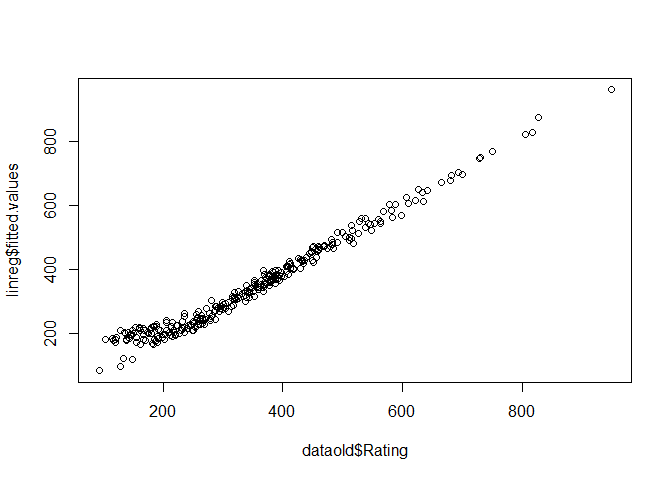
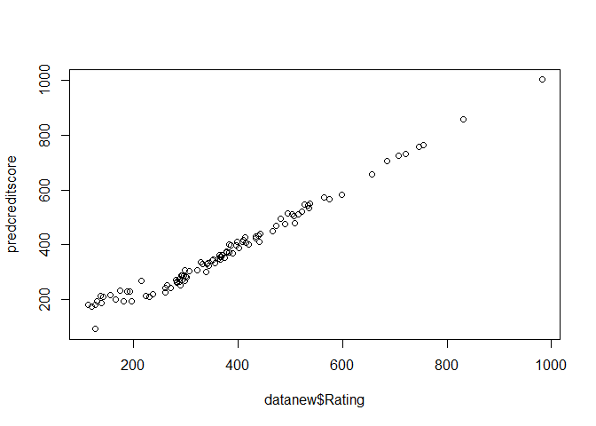
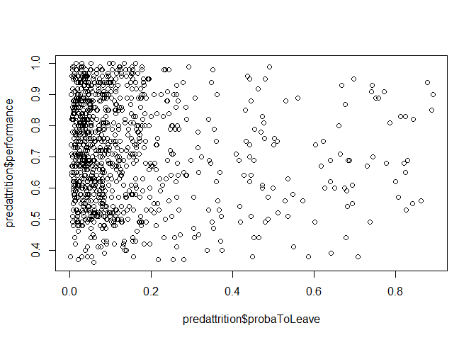
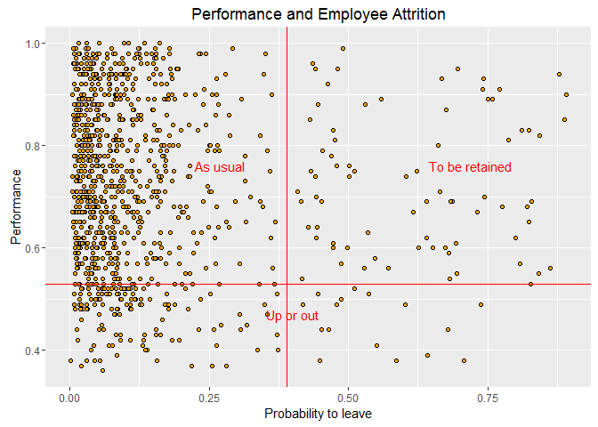
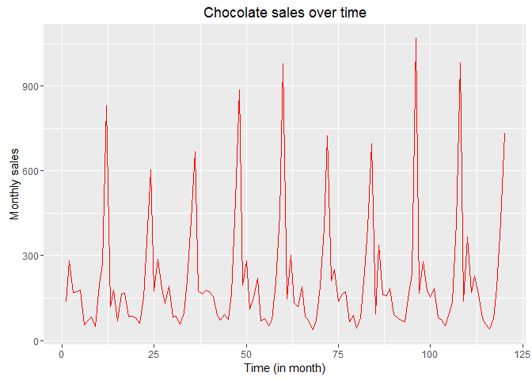
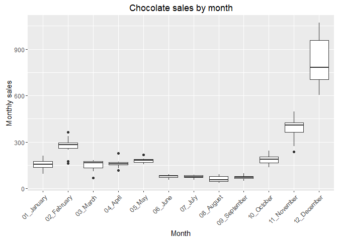
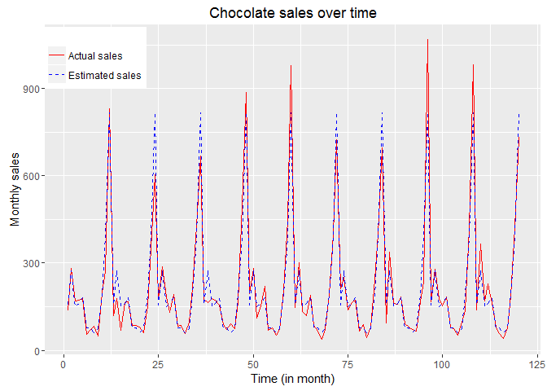

# Module 4 - Predictions and Forecasting
Nicolas  
April 29, 2016  

## Example #1 - Credit Scoring 2

### Loading the dataset

```r
rm(list=ls(all=TRUE))
dataold <- read.csv('DATA_3.01_CREDIT.csv') 
datanew <- read.csv('DATA_4.01_CREDIT2.csv') 
```

### Exploring the 'datanew' dataset

```r
str(datanew) 
```

```
## 'data.frame':	100 obs. of  10 variables:
##  $ Income   : num  21.8 31.3 59.9 44.1 82.7 ...
##  $ Rating   : int  355 289 365 352 536 165 287 298 332 494 ...
##  $ Cards    : int  1 3 1 1 2 2 3 3 2 3 ...
##  $ Age      : int  50 38 46 79 64 50 80 41 33 34 ...
##  $ Education: int  17 7 13 11 13 14 8 14 6 18 ...
##  $ Gender   : Factor w/ 2 levels " Male","Female": 1 2 2 1 2 2 1 2 1 2 ...
##  $ Student  : Factor w/ 2 levels "No","Yes": 1 1 1 1 1 1 1 1 1 1 ...
##  $ Married  : Factor w/ 2 levels "No","Yes": 2 1 2 2 2 2 2 2 1 2 ...
##  $ Ethnicity: Factor w/ 3 levels "African American",..: 3 3 3 1 2 2 3 2 2 3 ...
##  $ Balance  : int  580 172 295 414 905 0 70 0 681 885 ...
```

```r
summary(datanew)
```

```
##      Income           Rating          Cards           Age       
##  Min.   : 10.73   Min.   :112.0   Min.   :1.00   Min.   :23.00  
##  1st Qu.: 21.00   1st Qu.:282.0   1st Qu.:2.00   1st Qu.:44.00  
##  Median : 33.27   Median :363.0   Median :3.00   Median :57.50  
##  Mean   : 48.71   Mean   :375.4   Mean   :2.75   Mean   :57.72  
##  3rd Qu.: 61.80   3rd Qu.:448.0   3rd Qu.:3.00   3rd Qu.:71.00  
##  Max.   :182.73   Max.   :982.0   Max.   :9.00   Max.   :98.00  
##    Education        Gender   Student  Married             Ethnicity 
##  Min.   : 6.00    Male :61   No :92   No :38   African American:21  
##  1st Qu.:11.00   Female:39   Yes: 8   Yes:62   Asian           :21  
##  Median :14.00                                 Caucasian       :58  
##  Mean   :13.62                                                      
##  3rd Qu.:16.00                                                      
##  Max.   :19.00                                                      
##     Balance    
##  Min.   :   0  
##  1st Qu.: 191  
##  Median : 579  
##  Mean   : 572  
##  3rd Qu.: 890  
##  Max.   :1999
```
For example, the income range is from $10,730 to $182,730. The rating range is from 112 to 982, with a 375 average.

### Linear regression model
Let's build a linear regression model for the Rating, using the old dataset (ie training dataset):

```r
linreg <- lm(Rating ~ .,data=dataold) # Estimate a linear regression model of Rating (dependent variable) as a function of everything else (independent variables)
```

Since we assessed the accuracy of our model in the previous module, we can now test the model with the new dataset (test dataset):

```r
predcreditscore <- predict(linreg, newdata=datanew, type="response") 
head(predcreditscore)
```

```
##        1        2        3        4        5        6 
## 332.1505 251.2952 346.4296 344.7714 534.0896 200.8526
```
The predict function returns the prediction of the rating for each observation of the new dataset.

Let's see now how the model performs on the old dataset by looking at the correlation coefficient between the fitted values and the actual values:

```r
cor(linreg$fitted.values,dataold$Rating) # Computes the correlation between the fitted values and the actual ones
```

```
## [1] 0.9867324
```

```r
plot(dataold$Rating,linreg$fitted.values) # Plot the fitted values vs. the actual ones
```



The correlation coefficient is 0.986. The model fits the data pretty well.

Now, let's see now how the model performs on the new dataset by looking at the correlation coefficient between the predicted values and the actual values:

```r
cor(predcreditscore,datanew$Rating) # Computes the correlation between the fitted values and the actual ones
```

```
## [1] 0.988097
```

```r
plot(datanew$Rating,predcreditscore) # Plot the fitted values vs. the actual ones
```



The correlation coefficient is 0.988. The model does a good job on predicting new values.

***


##  Example #2 - HR analytics 3

### Loading the dataset

```r
rm(list=ls(all=TRUE))
dataold <- read.csv('DATA_3.02_HR2.csv')      # training dataset
datanew <- read.csv('DATA_4.02_HR3.csv')      # test dataset
```

### Exploring the 'datanew' dataset

```r
str(datanew)
```

```
## 'data.frame':	1000 obs. of  6 variables:
##  $ S      : num  0.86 0.52 0.84 0.6 0.85 0.82 0.62 0.69 0.88 0.36 ...
##  $ LPE    : num  0.69 0.98 0.6 0.65 0.57 0.61 0.53 0.8 0.68 0.65 ...
##  $ NP     : int  4 4 5 3 3 4 3 3 5 5 ...
##  $ ANH    : int  105 209 207 143 227 246 128 219 236 119 ...
##  $ TIC    : int  4 2 2 2 2 3 4 3 3 5 ...
##  $ Newborn: int  1 0 0 1 0 0 0 1 0 0 ...
```

```r
summary(datanew) 
```

```
##        S               LPE               NP             ANH       
##  Min.   :0.1200   Min.   :0.3600   Min.   :2.000   Min.   : 96.0  
##  1st Qu.:0.5300   1st Qu.:0.5900   1st Qu.:3.000   1st Qu.:160.0  
##  Median :0.6800   Median :0.7200   Median :4.000   Median :201.0  
##  Mean   :0.6626   Mean   :0.7193   Mean   :3.781   Mean   :200.2  
##  3rd Qu.:0.8500   3rd Qu.:0.8600   3rd Qu.:4.000   3rd Qu.:241.0  
##  Max.   :1.0000   Max.   :1.0000   Max.   :6.000   Max.   :287.0  
##       TIC           Newborn     
##  Min.   :2.000   Min.   :0.000  
##  1st Qu.:2.000   1st Qu.:0.000  
##  Median :3.000   Median :0.000  
##  Mean   :3.103   Mean   :0.197  
##  3rd Qu.:4.000   3rd Qu.:0.000  
##  Max.   :6.000   Max.   :1.000
```
There are 12,000 employees in the new dataset. An employee is working 200 hours/month on average. They have spent 3.1 year in the company on average.

### Logistic regression model
Let's build a logistic regression model, in order to estimate the probability of leaving ('left') based on the other variables of the old dataset:

```r
logreg <- glm(left ~ ., family=binomial(logit), data=dataold) # Estimate the drivers of attrition
```

Then we use the fitted model and make predictions on the new dataset:

```r
probaToLeave <- predict(logreg,newdata=datanew,type="response")
predattrition <- data.frame(probaToLeave) # Structure the prediction output in a dataframe
head(predattrition)
```

```
##   probaToLeave
## 1   0.01441962
## 2   0.10529195
## 3   0.01946618
## 4   0.01821424
## 5   0.03997737
## 6   0.06224061
```

Now we want to add the evaluation variable to the predattrition variable:

```r
predattrition$performance <- datanew$LPE # Add a column to the predattrition dataframe containing the performance
head(predattrition) 
```

```
##   probaToLeave performance
## 1   0.01441962        0.69
## 2   0.10529195        0.98
## 3   0.01946618        0.60
## 4   0.01821424        0.65
## 5   0.03997737        0.57
## 6   0.06224061        0.61
```


```r
plot(predattrition$probaToLeave,predattrition$performance)
```




```r
library(ggplot2)

ggplot(data=predattrition, aes(x=probaToLeave,y=performance)) + 
  geom_point(colour = "black", fill = "orange", shape = 21) +  # shape 21 has a border 
  xlab("Probability to leave") +
  ylab("Performance") +
  ggtitle("Performance and Employee Attrition") +
  geom_vline(xintercept = 0.39, color='red') +
  geom_hline(yintercept = 0.53, color='red') +
  annotate("text", x = 0.27, y = 0.76, label = "As usual", color='red') +
  annotate("text", x = 0.4, y = 0.47, label = "Up or out", color='red') +
  annotate("text", x = 0.72, y = 0.76, label = "To be retained", color='red')
```



Employees that should be retained are those with high performance and high likelyhood to leave. Actions should be targeted towards this people.

We can define a priority score ('priority'), as performance x probability to leave:

```r
predattrition$priority <- predattrition$performance*predattrition$probaToLeave
head(predattrition)
```

```
##   probaToLeave performance    priority
## 1   0.01441962        0.69 0.009949535
## 2   0.10529195        0.98 0.103186110
## 3   0.01946618        0.60 0.011679708
## 4   0.01821424        0.65 0.011839255
## 5   0.03997737        0.57 0.022787099
## 6   0.06224061        0.61 0.037966774
```

And then we rank the employees who should be retained by decreasing priority score:

```r
orderpredattrition <- predattrition[order(predattrition$priority,decreasing = TRUE),] #reordering the dataframe
head(orderpredattrition)
```

```
##     probaToLeave performance  priority
## 928    0.8784943        0.94 0.8257846
## 588    0.8916330        0.90 0.8024697
## 477    0.8882958        0.85 0.7550514
## 684    0.7715824        0.91 0.7021400
## 235    0.8432307        0.82 0.6914492
## 732    0.7424256        0.93 0.6904558
```
This allows to focus HR efforts for employee retention.

### Questions

1/ What is the ID of the employee that is the less likely to leave according to the estimated model?


```r
head( predattrition[order(predattrition$probaToLeave),] )
```

```
##     probaToLeave performance     priority
## 572  0.001336826        0.38 0.0005079939
## 388  0.004036227        0.90 0.0036326044
## 374  0.004456290        0.74 0.0032976543
## 810  0.004561275        0.67 0.0030560543
## 513  0.004920710        0.71 0.0034937043
## 288  0.005409867        0.82 0.0044360913
```
According to the model, employee #572 is the less likely to leave.

2/ What is the ID of the employee that is the less likely to leave according to the estimated model and who has a performance larger than 0.90?


```r
sub_attrition <- subset(predattrition, performance>0.90)
head( sub_attrition[order(sub_attrition$probaToLeave),] )
```

```
##     probaToLeave performance    priority
## 322  0.005690086        0.96 0.005462483
## 761  0.006229770        0.99 0.006167472
## 886  0.006957936        0.92 0.006401301
## 156  0.007112110        0.98 0.006969868
## 865  0.007950425        0.96 0.007632408
## 307  0.008591105        0.95 0.008161549
```
According to the model, employee #322 is the less likely to leave and has a performance larger than 0.90.


***


## Example #3 - Predictive Maintenance (Survival Analysis)

In this example, we are trying to estimate the remaining lifetime of mechanical parts.

### Loading and exploring the data

```r
rm(list=ls(all=TRUE))
data <- read.csv('DATA_4.03_MNT.csv')
```


```r
str(data)
```

```
## 'data.frame':	1000 obs. of  7 variables:
##  $ lifetime      : int  56 81 60 86 34 30 68 65 23 81 ...
##  $ broken        : int  0 1 0 1 0 0 0 1 0 1 ...
##  $ pressureInd   : num  92.2 72.1 96.3 94.4 97.8 ...
##  $ moistureInd   : num  104.2 103.1 77.8 108.5 99.4 ...
##  $ temperatureInd: num  96.5 87.3 112.2 72 103.8 ...
##  $ team          : Factor w/ 3 levels "TeamA","TeamB",..: 1 3 1 3 2 1 2 2 2 3 ...
##  $ provider      : Factor w/ 4 levels "Provider1","Provider2",..: 4 4 1 2 1 1 2 3 2 4 ...
```

```r
summary(data)
```

```
##     lifetime        broken       pressureInd      moistureInd    
##  Min.   : 1.0   Min.   :0.000   Min.   : 33.48   Min.   : 58.55  
##  1st Qu.:34.0   1st Qu.:0.000   1st Qu.: 85.56   1st Qu.: 92.77  
##  Median :60.0   Median :0.000   Median : 97.22   Median : 99.43  
##  Mean   :55.2   Mean   :0.397   Mean   : 98.60   Mean   : 99.38  
##  3rd Qu.:80.0   3rd Qu.:1.000   3rd Qu.:112.25   3rd Qu.:106.12  
##  Max.   :93.0   Max.   :1.000   Max.   :173.28   Max.   :128.60  
##  temperatureInd      team          provider  
##  Min.   : 42.28   TeamA:336   Provider1:254  
##  1st Qu.: 87.68   TeamB:356   Provider2:266  
##  Median :100.59   TeamC:308   Provider3:242  
##  Mean   :100.63               Provider4:238  
##  3rd Qu.:113.66                              
##  Max.   :172.54
```
In this dataset, about 40% of the pieces are broken. For example, about 336 pieces have been allocated to teamA, and 254 pieces has been supplied by Provider1.

### Linear regression model

Let's build a linear regression model, in order to estimate the lifetime of a pieces ('lifetime') based on the other variables of the dataset (minus the 'broken' variable):

```r
linregmodel <- lm(lifetime~.-broken,data=data)  # Build a linear regression model
summary(linregmodel)
```

```
## 
## Call:
## lm(formula = lifetime ~ . - broken, data = data)
## 
## Residuals:
##     Min      1Q  Median      3Q     Max 
## -59.388 -21.788   8.051  21.112  34.891 
## 
## Coefficients:
##                     Estimate Std. Error t value Pr(>|t|)    
## (Intercept)       59.3732039 10.3412622   5.741 1.25e-08 ***
## pressureInd       -0.0031500  0.0416461  -0.076   0.9397    
## moistureInd       -0.0173023  0.0830046  -0.208   0.8349    
## temperatureInd    -0.0002769  0.0421330  -0.007   0.9948    
## teamTeamB          1.5491323  1.9983947   0.775   0.4384    
## teamTeamC         -3.4280411  2.0670679  -1.658   0.0976 .  
## providerProvider2  0.8835691  2.2944030   0.385   0.7002    
## providerProvider3 -9.4858216  2.3490911  -4.038 5.80e-05 ***
## providerProvider4  1.8679357  2.3616268   0.791   0.4292    
## ---
## Signif. codes:  0 '***' 0.001 '**' 0.01 '*' 0.05 '.' 0.1 ' ' 1
## 
## Residual standard error: 26.13 on 991 degrees of freedom
## Multiple R-squared:  0.0339,	Adjusted R-squared:  0.0261 
## F-statistic: 4.346 on 8 and 991 DF,  p-value: 3.619e-05
```
It appears that the providerProvider3 variable is statistically significant and has a negative effect on the lifetime of a piece. Here we cannot use a linear regression model because about 60% of the pieces haven't not broken yet. We don't know what the lifetime will be for pieces that haven't broken yet. All we know is that they are working until now. 

### Survival regression model

As seen in the lecture, we need to create a survival regression model:

```r
#install.packages("survival")
library(survival) # Load the survival package
```

```r
dependantvars <- Surv(data$lifetime, data$broken) # choose the dependant variables to be used in the survival regression model with the Surv() function
survreg <- survreg(dependantvars ~ pressureInd + moistureInd + temperatureInd + team + provider, dist="gaussian",data=data) # Create the survival regression model
summary(survreg) 
```

```
## 
## Call:
## survreg(formula = dependantvars ~ pressureInd + moistureInd + 
##     temperatureInd + team + provider, data = data, dist = "gaussian")
##                       Value Std. Error        z        p
## (Intercept)        8.04e+01    0.29371  273.574 0.00e+00
## pressureInd       -7.14e-04    0.00122   -0.587 5.57e-01
## moistureInd        6.01e-03    0.00240    2.505 1.22e-02
## temperatureInd    -1.04e-02    0.00121   -8.593 8.49e-18
## teamTeamB         -5.67e-02    0.05882   -0.964 3.35e-01
## teamTeamC         -6.22e+00    0.06132 -101.392 0.00e+00
## providerProvider2  1.25e+01    0.06665  187.464 0.00e+00
## providerProvider3 -1.44e+01    0.06275 -229.241 0.00e+00
## providerProvider4  7.92e+00    0.07056  112.233 0.00e+00
## Log(scale)        -7.43e-01    0.03540  -20.998 6.86e-98
## 
## Scale= 0.476 
## 
## Gaussian distribution
## Loglik(model)= -270.1   Loglik(intercept only)= -1557
## 	Chisq= 2573.75 on 8 degrees of freedom, p= 0 
## Number of Newton-Raphson Iterations: 12 
## n= 1000
```
For example, moisture and temperature are statistically significant. Moisture has a positive effect on the lifetime, whereas the temperature has a negative effect.

Now let's make predictions on the estimated lifetime, using the survival regression model we just built. The predict function will output the median lifetime of each piece:

```r
Ebreak <- predict(survreg, newdata=data, type="quantile", p=.5) # Make predictions based on the model. We are setting the quantile to 50%. Hence, we estimate the median lifetime as the expected moment of "death"

Forecast <- data.frame(Ebreak) # Create a dataframe to store the ouput of Ebreak
```

Then we add the following columns to the predicted median expected lifetime dataframe:
- lifetime (= how a piece has been 'alive')
- broken (= is the piece broken or not?)
- remaining lifetime (=expected lifetime - lifetime to date)

```r
Forecast$lifetime <- data$lifetime  # Add a column in the Forecast dataframe indicating the lifetime of the piece
Forecast$broken <- data$broken # Add a column in the Forecast dataframe indicating whether or not the piece is broken
Forecast$RemainingLT <- Forecast$Ebreak - data$lifetime     # Computed Expected Remaining Lifetime

head(Forecast)
```

```
##     Ebreak lifetime broken RemainingLT
## 1 87.82547       56      0  31.8254667
## 2 81.71139       81      1   0.7113900
## 3 79.58070       60      0  19.5806969
## 4 86.46185       86      1   0.4618547
## 5 79.74085       34      0  45.7408455
## 6 80.04827       30      0  50.0482673
```

In order to take actions, we clean up the report by prioritizing (order by expected lifetime) and keeping only the non broken pieces:

```r
Forecast <- Forecast[order(Forecast$RemainingLT),] # Orders the dataframe by Expected Remaining Lifetime
ActionsPriority <- Forecast[Forecast$broken==0,] # And keeps only those who are not broken yet
head(ActionsPriority)
```

```
##       Ebreak lifetime broken RemainingLT
## 80  87.81934       88      0  -0.1806637
## 920 65.39920       65      0   0.3992047
## 138 81.62875       81      0   0.6287524
## 455 87.79644       87      0   0.7964376
## 917 85.91101       85      0   0.9110116
## 414 81.97309       81      0   0.9730926
```

### Questions

1/ If instead of considering the effects significant when the p-value is smaller than 0.05 (as during the videos), we set the threshold of significance to 0.01, which one of the following is correct?

```r
summary(survreg) 
```

```
## 
## Call:
## survreg(formula = dependantvars ~ pressureInd + moistureInd + 
##     temperatureInd + team + provider, data = data, dist = "gaussian")
##                       Value Std. Error        z        p
## (Intercept)        8.04e+01    0.29371  273.574 0.00e+00
## pressureInd       -7.14e-04    0.00122   -0.587 5.57e-01
## moistureInd        6.01e-03    0.00240    2.505 1.22e-02
## temperatureInd    -1.04e-02    0.00121   -8.593 8.49e-18
## teamTeamB         -5.67e-02    0.05882   -0.964 3.35e-01
## teamTeamC         -6.22e+00    0.06132 -101.392 0.00e+00
## providerProvider2  1.25e+01    0.06665  187.464 0.00e+00
## providerProvider3 -1.44e+01    0.06275 -229.241 0.00e+00
## providerProvider4  7.92e+00    0.07056  112.233 0.00e+00
## Log(scale)        -7.43e-01    0.03540  -20.998 6.86e-98
## 
## Scale= 0.476 
## 
## Gaussian distribution
## Loglik(model)= -270.1   Loglik(intercept only)= -1557
## 	Chisq= 2573.75 on 8 degrees of freedom, p= 0 
## Number of Newton-Raphson Iterations: 12 
## n= 1000
```
Pressure and Moisture are non-significant. Temperature is significant.

2/ If you use as explanatory variables only the Pressure, Moisture and Temperature indices (hence removing the teams and providers information), which one of the following is correct?

```r
survreg2 <- survreg(dependantvars ~ pressureInd + moistureInd + temperatureInd, dist="gaussian",data=data)
summary(survreg2) 
```

```
## 
## Call:
## survreg(formula = dependantvars ~ pressureInd + moistureInd + 
##     temperatureInd, data = data, dist = "gaussian")
##                  Value Std. Error      z        p
## (Intercept)    75.8525     5.9187 12.816 1.34e-37
## pressureInd     0.0228     0.0249  0.913 3.61e-01
## moistureInd     0.0394     0.0495  0.796 4.26e-01
## temperatureInd -0.0223     0.0251 -0.889 3.74e-01
## Log(scale)      2.3528     0.0340 69.187 0.00e+00
## 
## Scale= 10.5 
## 
## Gaussian distribution
## Loglik(model)= -1555.9   Loglik(intercept only)= -1557
## 	Chisq= 2.19 on 3 degrees of freedom, p= 0.53 
## Number of Newton-Raphson Iterations: 6 
## n= 1000
```
For this model, Pressure, Moisture and Temperature indexes are greater than 0.05. Hence they are not statistically significant.

3/ What is the ID of the element that has the largest expected remaining lifetime?

```r
head( Forecast[order(-Forecast$RemainingLT),] )
```

```
##       Ebreak lifetime broken RemainingLT
## 53  92.24826        1      0    91.24826
## 472 92.55563        2      0    90.55563
## 877 92.31880        2      0    90.31880
## 225 92.87914        3      0    89.87914
## 708 92.69553        4      0    88.69553
## 852 92.27872        5      0    87.27872
```
Item #53 has the largest expected remaining lifetime.


***


## Example #4 - Seasonal sales of Chocolates

### Loading the dataset

```r
rm(list=ls())
data <- read.csv('DATA_4.04_CHOC.csv')
```

### Exloring the dataset

```r
str(data) 
```

```
## 'data.frame':	120 obs. of  4 variables:
##  $ time : int  1 2 3 4 5 6 7 8 9 10 ...
##  $ sales: num  135 282 171 171 179 ...
##  $ year : int  2000 2000 2000 2000 2000 2000 2000 2000 2000 2000 ...
##  $ month: Factor w/ 12 levels "01_January","02_February",..: 1 2 3 4 5 6 7 8 9 10 ...
```

```r
summary(data$sales) 
```

```
##    Min. 1st Qu.  Median    Mean 3rd Qu.    Max. 
##   36.85   82.88  163.00  216.70  221.30 1069.00
```
There is about 10 years of monthly sales data. On average, 216 units were sold monthly.


```r
ggplot(data=data, aes(x=time,y=sales)) + 
  geom_line(color='red') +
  xlab("Time (in month)") +
  ylab("Monthly sales") +
  ggtitle("Chocolate sales over time")
```



We see that the data shows seasonality.

In order to better understand what drives the sales, then let's start by creating a linear regression model of the sales (dependent variable) as a function of the month of the year (independant variable):

```r
regres <- lm(sales ~ month,data=data) # Build a linear regression model
summary(regres)
```

```
## 
## Call:
## lm(formula = sales ~ month, data = data)
## 
## Residuals:
##     Min      1Q  Median      3Q     Max 
## -212.46  -17.49    2.26   19.87  251.38 
## 
## Coefficients:
##                   Estimate Std. Error t value Pr(>|t|)    
## (Intercept)        156.211     18.306   8.533 9.78e-14 ***
## month02_February   116.377     25.889   4.495 1.75e-05 ***
## month03_March       -6.559     25.889  -0.253 0.800479    
## month04_April        4.846     25.889   0.187 0.851854    
## month05_May         24.245     25.889   0.937 0.351100    
## month06_June       -78.034     25.889  -3.014 0.003212 ** 
## month07_July       -80.262     25.889  -3.100 0.002466 ** 
## month08_August     -94.941     25.889  -3.667 0.000382 ***
## month09_September  -81.921     25.889  -3.164 0.002020 ** 
## month10_October     30.185     25.889   1.166 0.246208    
## month11_November   230.894     25.889   8.919 1.33e-14 ***
## month12_December   661.034     25.889  25.533  < 2e-16 ***
## ---
## Signif. codes:  0 '***' 0.001 '**' 0.01 '*' 0.05 '.' 0.1 ' ' 1
## 
## Residual standard error: 57.89 on 108 degrees of freedom
## Multiple R-squared:  0.9312,	Adjusted R-squared:  0.9242 
## F-statistic: 132.9 on 11 and 108 DF,  p-value: < 2.2e-16
```
Looking at the p-values, we can tell that most of the months are statistically significant (except for march, may, may, oct). Also, looking at the t-values, we can tell that november and december have the strongest positive effect on the sales.

### Boxplots of monthly sales

Let's see the sale distribution for each month:

```r
ggplot(data=data, aes(x=month,y=sales)) + 
  geom_boxplot() +
  xlab("Month") +
  ylab("Monthly sales") +
  ggtitle("Chocolate sales by month") +
  theme(axis.text.x = element_text(angle = 45, vjust = 1, hjust=1))
```



We observe that, from year to year, the there is much more variation in sales in december than in july.

### Testing the model on past data

How does the model perform on past data?

```r
ggplot(data=data) + 
  geom_line(aes(x=time,y=sales, color='Actual sales')) +
  xlab("Time (in month)") +
  ylab("Monthly sales") +
  ggtitle("Chocolate sales over time") +
  geom_line(aes(x=time,y=regres$fitted.values, color='Estimated sales'), linetype=2) +
  theme(legend.position=c(0.10,0.90)) + 
  scale_colour_manual("", values = c("Actual sales"="red", "Estimated sales"="blue")) +
  guides(colour = guide_legend(override.aes = list(linetype=c(1,2))))
```



